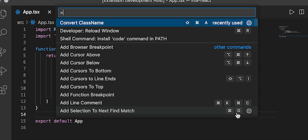
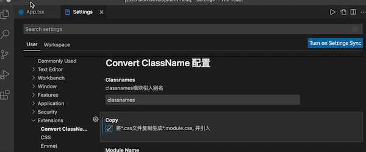

# Convert ClassName

一个将JSX/TSX中的 `className="xxx"` 转化为 `className={style.xxx}`插件

# 命令
按`cmd + shift + P` 输入 `Convert ClassName`

# 快捷键

cmd + shift + a

# 

# 下载
已经上架：[marketplace.visualstudio.com]()
或者在vscode扩展中直接搜索`classnames`安装即可

# 说明
可以只转化选择代码
将JSX/TSX中的 `className="xxx"` 转化为 `className={style.xxx}`

# 支持语言
JSX/TSX

# 配置

| 配置名                | 作用                            | 默认值       |
| --------------------- | ------------------------------- | ------------ |
| classnames.moduleName | 引入css模块名称                 | 'style'      |
| classnames.classnames | 引入classnames别名              | 'classnames' |
| classnames.copy       | 复制`*.css`文件到`*.module.css` | false        |

